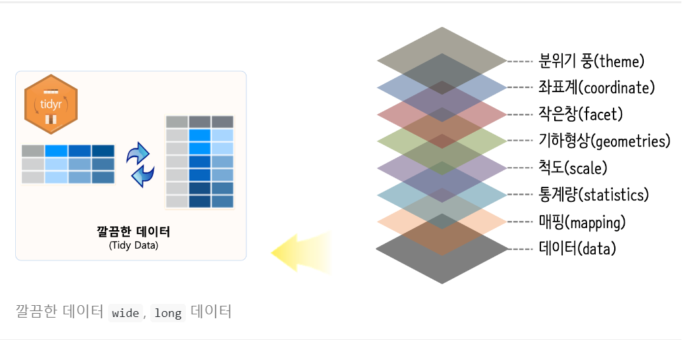
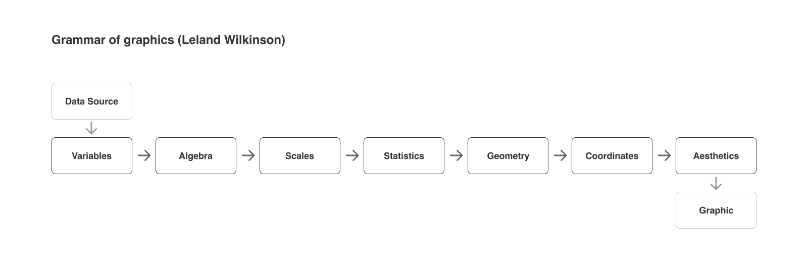

```{r setup, include=FALSE}
knitr::opts_chunk$set(echo=T, fig.align = "center", message=F, warning=F, fig.height = 8, cache=T, dpi = 300, dev = "png")
```

# The Grammar of Graphics

그래픽 문법(grammar of graphics)은 릴랜드 윌킨스(Leland Wilkinson)의 책 `The Grammar of Graphics`에서 유행시킨 단어입니다. 데이터를 어떻게 표현할 것인지에 대한 내용이 책의 전반적인 주제입니다.

```
문법은 언어의 표현을 풍부하게 만든다. 단어만 있고 문법이 없는 언어가 있다면(단어 = 문장), 오직 단어의 갯수만큼만 생각을 표현할 수 있다. 문장 내에서 단어가 어떻게 구성되는 지를 규정함으로써, 문법은 언어의 범위를 확장한다. - Leland Wilkinson, "The Grammar of Graphics", 2005.
```

The Grammar of Graphics에서 말하는 말하는 문법적 요소는 다음과 같습니다.

- Data, 시각화에 사용될 데이터
- Aesthetics, 데이터를 나타내는 시각적인 요소(x축, y축, 사이즈, 색깔, 모양 등)
- Geometrics, 데이터를 나타내는 도형
- Facets, 하위 집합으로 분할하여 시각화
- Statistics, 통계값을 표현
- Coordinates, 데이터를 표현 할 이차원 좌표계
- Theme, 그래프를 꾸밈

ggplot2 패키지의 앞글자가 gg인 것에서 유추할 수 있듯이 ggplot2 패키지는 그래픽 문법을 토대로 시각화를 표현하며, 전반적인 시각화의 순서는 위의 순서와 아래 이미지와 같습니다. ggplot2 패키지의 특징은 각 요소를 연결할 때 `+` 기호를 사용한다는 점이며, 이는 그래픽 문법의 순서에 따라 요소들을 쌓아나간 후 최종적인 그래픽을 완성하는 패키지의 특성 때문입니다.



The Grammar of Graphics에서 그래픽 문법을 적용하는 과정을 도식화 시킨 이미지는 아래와 같습니다.
 


1. Create Variables
- 데이터 소스에서 원하는 변수를 추출하고, 필요한 경우 값을 변환합니다. SQL의 SELECT 문에 해당하는 작업입니다.

2. Apply Algebra
- 여러 변수에 연산을 적용하여 원하는 형태의 데이터를 구성합니다. SQL의 JOIN, UNION ALL 등의 작업을 의미합니다.

3. Apply Scales
- 변수들 사이의 관계나, 데이터가 의미하는 바가 잘 나타나도록 값을 변환합니다. 카테고리 변수를 잘 구분할 수 있도록 색상이나 순서로 변환합니다. 숫자 변수의 특성을 잘 나타낼 수 있도록 변환(Linear, Log, Pow 등)하거나 시간에 따른 변화를 나타낼 수 있도록 변환(연도, 월, 일, 시간 등)합니다.

4. Compute Statistics
- 그래프에 표현될 기하학적인 객체에 반영하기 위한 목적으로 데이터를 변환합니다. 이 작업을 데이터 정제 작업과 독립적으로 둘 수 있으면, 동일한 데이터에서 평균과 분산을 각각 계산하여 시각화 하는 것도 가능해집니다.

5. Construct Geometry
- 점, 선, 면 등 기하학적인 요소를 통해 데이터를 표현합니다. 같은 위치에서 여러 그래픽 요소가 겹쳐있는 경우 별도의 작업을 추가하여 해결합니다. 막대가 겹치는 경우에는 누적 막대로 쌓거나(stack) 막대를 옆으로 나란히 배치(dodge)할 수 있습니다. 점이 겹치는 경우에는 좌우로 흩뿌려서(jitter) 겹치는 점을 표현할 수 있습니다. 위와 같은 작업을 Collision Modifier 라고 합니다.

6. Apply Coordinates
- 좌표계를 통해 특정한 점을 그래프에 어떻게 표시할지 결정합니다. 원하는 내용을 잘 표현하기 위한 목적으로 좌표계를 회전하거나, 왜곡할 수 있습니다.

7. Compute Aesthetics
- Geometry 객체에 크기, 두께, 색상, 질감 등 추가적인 속성을 부여합니다. Aesthetics Attributes 는 그래프에서 우리가 시각적으로 구분할 수 있는 미적인 요소들을 의미합니다.

위의 항목을 고려해서 최종적으로 6가지 항목을 통해 그래픽 스펙을 설명할 수 있습니다.

1. DATA → 데이터셋에서 추출한 변수들의 집합을 말합니다.
2. TRANS → 변수 변환을 의미합니다. (sort, rank, residual 등)
3. SCALE → 스케일 변환을 의미합니다. (log 등)
4. COORD → 좌표계를 의미합니다. (cartesian, polar 등)
5. ELEMENT → 그래픽으로 표현할 대상(점, 막대 등)과 표현에 필요한 시각적 요소(크기, 색상 등)를 말합니다.
6. GUIDE → 축, 범례 등 데이터를 이해하는데 도움을 주는 가이드 요소를 말합니다.

```{R}
# 패키지가 없으면 설치하세요.
library(tidyverse)
library(palmerpenguins)
```

# Overview

기초 입문용으로 사용했던 `iris`의 몇가지 문제점을 해결하기 위해서 만들어진 데이터로, 기초적인 데이터 핸들링 및 시각화에 좋은 데이터로 구성되어 있습니다. 해당 데이터는 `penguins`로 확인할 수 있습니다. 펭귄 종류(species), 서식지(island), 부리 길이와 깊이(bill_length_mm, bill_depth_mm), 날개 길이(flipper_length_mm), 몸무게, 생물학적 성별, 년도로 구성되어 있습니다.

```{R}
# str(penguins)
glimpse(penguins)
```

344개의 관측값(표본), 8개의 변수, NA가 섞여있는 것을 쉽게 확인할 수 있습니다. 이 중에서 NA를 확인하는 방법은 아래 코드를 참고하세요.

```{R}
t(map_df(penguins, ~sum(is.na(.))))
```

NA 값을 제거하도록 하겠습니다.

```{R}
plot_data <- penguins %>% 
  drop_na()
t(map_df(plot_data, ~sum(is.na(.))))
```

먼저 이미지로 출력해야 할

```{R}
count_data <- plot_data %>% 
    group_by(species) %>% 
    tally()
count_data
```

```{R}
count_data$species <- fct_recode(
  count_data$species,
  "아델리" = "Adelie",
  "친스트랩" = "Chinstrap",
  "갠투" = "Gentoo"
)

count_data$species <- fct_reorder(count_data$species, count_data$n)

ggplot(count_data) +
    aes(x = species, fill = species, weight = n) +
    geom_bar() +
    coord_flip() +
    scale_fill_manual(
        values = c(아델리 = "#0D0887",
                   친스트랩 = "#CA4778",
                   갠투 = "#F0F921")
    ) +
    labs(
        x = "펭귄 종류",
        y = "개체 수 (마리)",
        title = "팔머 펭귄 종별 개체 수",
        caption = "Esquisse 패키지를 통한 plotting",
        fill = "펭귄 종류"
    ) +
    theme_bw() +
    theme(legend.position = "bottom")
```

```{R}
ggplot(count_data) +
    aes(x = species, fill = species, weight = n) +
    geom_bar() +
    coord_flip() +
    labs(
        x = "펭귄 종류",
        y = "개체 수 (마리)",
        title = "팔머 펭귄 종별 개체 수",
        caption = "Esquisse 패키지를 통한 plotting & ggthemr",
        fill = "펭귄 종류"
    ) +
    theme(legend.position = "bottom",
          text = element_text(size=16,  
                    family="D2Coding"),
          plot.title = element_text(size = 24),
          plot.caption = element_text(size = 10))
```

```{R}
p <- ggplot(plot_data) +
  aes(
    x = bill_length_mm,
    y = bill_depth_mm,
    colour = species,
    size = body_mass_g
  ) +
  geom_point(shape = "circle", alpha = 0.5) +
  scale_color_hue(direction = 1) +
  scale_alpha_identity() +
  labs(
    x = "부리 길이 (단위: mm)",
    y = "부리 깊이 (단위: mm)",
    title = "펭귄 종별 부리길이와 깊이 비교",
    color = "펭귄종류",
    size = "몸무게"
  ) +
  theme(legend.position = "bottom",
        legend.box = "vertical",
        legend.margin=margin(),
        text = element_text(size=16, family="Noto Serif CJK KR"),
        plot.title = element_text(size = 20),
        plot.caption = element_text(size = 10)) +
  facet_wrap(vars(island))
```

```R
ggsave("scatter-plot.pdf", p, width = 10, height = 6, dpi = 300, device = cairo_pdf)
```

# ggplot2

## 레이어란?

- aes, X축과 Y축을 이어주는 레이어
- geom, 그래프의 요소들을 설정하는 레이어
- scale, 그래프의 색깔을 설정하는 레이어
- theme, 그래프의 테마를 설정하는 레이어

```{R}
ggplot(penguins) +
  aes(x = bill_length_mm, 
      y = bill_depth_mm, 
      colour = species) +
  geom_point(shape = "circle",
              size = 1.5) +
  scale_color_manual(
    values = c(Adelie = "#F8766D",
            Chinstrap = "#00C19F",
               Gentoo = "#FF61C3")
  ) +
  theme(legend.position = "bottom",
      text = element_text(size=16,  
                family="D2Coding"),
      plot.title = element_text(size = 24),
      plot.caption = element_text(size = 10))
```


## Data
표현하고자 하는 데이터를 등록하는 것 입니다. ggplot은 입력되는 자료가 data.frame 혹은 tibble의 형태여야 합니다. 따라서 자료는 tidy 형태 입니다.
 
- 변수를 나타내는 `열`
- 표본을 나타내는 `행`

```{R}
ggplot(data = penguins)
```

## Aesthetics

그래프의 속성을 데이터의 정보와 연결하는 레이어입니다. aesthetics에서 설정하는 주요 요소들은 `x`,`y`, `alpha`, `color`, `fill`, `shape`, `size` 입니다. 데이터의 정보와 요소들을 연결하는 것으로 `X축`과 `Y축`이 데이터 정보와 연결됩니다.

```{R}
ggplot(data = penguins) + 
  aes(x = bill_length_mm,
      y = bill_depth_mm)
```


## Geometric

시각적으로 표현하고자 하는 기하학적인(점, 선, 면, ...) 요소를 사용하여 정보를 표현할 것인지 결정하는 것 입니다.

- geom_point()
- geom_path()
- geom_bar()
- geom_contour()

```{R}
ggplot(data = penguins) + 
  aes(x = bill_length_mm,
      y = bill_depth_mm) + 
  geom_point(aes(color = species, 
                 size = (body_mass_g / 1000),
                 alpha = 0.7))
```

## aes() + geom() 을 어떻게 결합해야 할까?

- 데이터 1개 + 맵핑 1개
- 데이터 1개 + 맵핑 N개
- 데이터 N개 + 맵핑 N개

```R
# Method 1 
ggplot(data = penguins,
       aes(x = body_mass_g, 
          y = bill_length_mm))
# Method 2
ggplot(data = penguins) +
  geom_point(
    aes(x = body_mass_g, 
        y = bill_length_mm))
# Method 3
ggplot() +
  geom_point(data = penguins,
             aes(x = body_mass_g, 
                 y = bill_length_mm))
```

## scales

`축`을 설정하는 것 입니다. `scale_<aes>_<type>` 형태의 함수를 제공합니다.

```{R}
ggplot(data = penguins) + 
  aes(x = bill_length_mm,
      y = bill_depth_mm) + 
  geom_point(aes(color = species, 
                 size = (body_mass_g / 1000),
                 alpha = 0.7)) +
  scale_y_continuous("부리 깊이 (단위 mm)",
                     breaks = seq(0, 30, by = 2),
                     labels = paste(seq(0, 30, by = 2), "mm"),
                     minor_breaks = NULL) +
  scale_x_continuous("부리 길이 (단위 mm)",
                     breaks = seq(30, 60, by = 5),
                     labels = paste(seq(30, 60, by = 5), "mm"),
                     minor_breaks = NULL) +
  scale_alpha_identity() +
  scale_size_identity() +
  scale_color_brewer(
    palette = "Set1",
    labels = c("Adele 펭귄","Chinstrap 펭귄","Gentoo 펭귄")) +
  guides(color = guide_legend(title = "펭귄종류", ncol = 3)) +
  theme(legend.position = "bottom")
```


## facet 레이어

데이터 안의 특정 변수를 사용하여 여러개의 데이터 특성을 나타낼 때 사용합니다.

```{R}
ggplot(data = penguins) + 
  aes(x = bill_length_mm,
      y = bill_depth_mm) + 
  geom_point(aes(color = species, 
                 size = (body_mass_g / 1000),
                 alpha = 0.7)) +
  scale_y_continuous("부리 깊이 (단위 mm)",
                     breaks = seq(0, 30, by = 2),
                     labels = paste(seq(0, 30, by = 2), "mm"),
                     minor_breaks = NULL) +
  scale_x_continuous("부리 길이 (단위 mm)",
                     breaks = seq(30, 60, by = 5),
                     labels = paste(seq(30, 60, by = 5), "mm"),
                     minor_breaks = NULL) +
  scale_alpha_identity() +
  scale_size_identity() +
  scale_color_brewer(
    palette = "Set1",
    labels = c("Adele 펭귄","Chinstrap 펭귄","Gentoo 펭귄")) +
  guides(color = guide_legend(title = "펭귄종류", ncol = 3)) +
  theme(legend.position = "bottom") +
  # facet_wrap(vars(island)) +
  facet_grid(sex ~ island)
```


## 제목, 부제목, 캡션 넣기

```{R}
ggplot(data = penguins) + 
  aes(x = bill_length_mm,
      y = bill_depth_mm) + 
  geom_point(aes(color = species, 
                 size = (body_mass_g / 1000),
                 alpha = 0.7)) +
  scale_y_continuous("부리 깊이 (단위 mm)",
                     breaks = seq(0, 30, by = 2),
                     labels = paste(seq(0, 30, by = 2), "mm"),
                     minor_breaks = NULL) +
  scale_x_continuous("부리 길이 (단위 mm)",
                     breaks = seq(30, 60, by = 5),
                     labels = paste(seq(30, 60, by = 5), "mm"),
                     minor_breaks = NULL) +
  scale_alpha_identity() +
  scale_size_identity() +
  scale_color_brewer(
    palette = "Set1",
    labels = c("Adele 펭귄","Chinstrap 펭귄","Gentoo 펭귄")) +
  guides(color = guide_legend(title = "펭귄종류", ncol = 3)) +
  theme(legend.position = "bottom") +
  # facet_wrap(vars(island)) +
  facet_grid(sex ~ island) +
  labs(
    title = "팔머펭귄 시각화",
    subtitle = "종별 부리길이 vs. 부리깊이",
    caption = "2023년 6월  수업 중 자료"
  )
```
